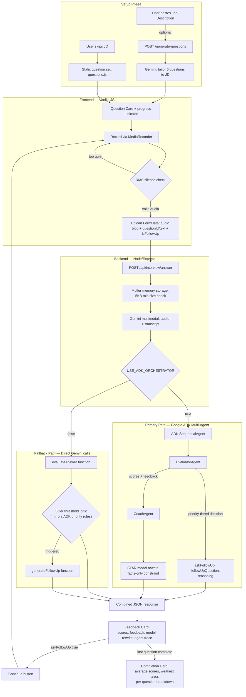

# Interview Practice — Architecture

## System Diagram

## Component Breakdown

### 1. Frontend (`public/`)
Vanilla HTML/CSS/JS — no framework. Handles question display, MediaRecorder-based audio
capture, a client-side RMS silence check (via the Web Audio API's AnalyserNode) to avoid
uploading empty recordings, and rendering of the AI response, including a live
mic-driven waveform visualization during recording and a progress indicator across the
session.

### 2. Backend (`server/`)
Express app. `server/routes/interview.js` handles question retrieval/generation and the
core answer-submission endpoint. Audio is transcribed via Gemini's multimodal endpoint
using the existing (pre-agent-refactor) transcription call — this step was deliberately
kept outside the ADK migration, since it was already working and multimodal-verified,
to minimize risk during the agent migration.

### 3. Agent layer (`server/agents/`)
Built on Google's Agent Development Kit (`@google/adk`, TypeScript). Originally
designed as four separate agents (Evaluator, Coach, Interviewer, and an LLM-driven
Orchestrator); refactored during development into a leaner two-agent
`SequentialAgent` pipeline after discovering the routing-agent design added an extra
paid inference call for a decision that could live inside the Evaluator's own output:

- **EvaluatorAgent** — scores specificity, relevance, and structure; generates
  feedback; and makes the follow-up decision itself using an explicit three-tier
  priority rule (strong answers default to no follow-up; any low score triggers one;
  mid-range scores trigger one only if a specific claim was left unexplained).
- **CoachAgent** — rewrites the answer in STAR structure, constrained to only use
  facts present in the original transcript.

### 4. Resilience layer
A `USE_ADK_ORCHESTRATOR` environment flag switches between the ADK pipeline and a
fully independent fallback implementation using direct Gemini calls through the
pre-existing `server/services/gemini.js` functions. The fallback replicates the same
response schema and the same tuned decision thresholds (with one intentional
simplification: the ADK path's semantic "is there an unexplained gap" check in the
mid-range score band isn't reproducible in plain conditional logic, so the fallback
defaults conservatively to no follow-up in that narrow band). This was built and
explicitly verified end-to-end, independent of the primary path, so the app degrades
gracefully rather than failing outright if the agent layer misbehaves.

### 5. Deployment
Dockerized, deployed on Render. Environment variables (`GOOGLE_API_KEY`,
`USE_ADK_ORCHESTRATOR`) are set at the platform level, not via a committed `.env` file.

## Key Design Decisions
- **Audio transcription was kept outside the ADK migration.** Multimodal input
  handling inside ADK TypeScript was an unverified surface at the time of migration;
  isolating that risk kept a working, previously-verified pipeline stable while the
  agent layer was built and debugged.
- **The Orchestrator was collapsed from a separate LLM-driven routing agent into
  logic inside EvaluatorAgent.** A dedicated routing agent added a full extra
  inference call per turn for a decision the Evaluator already has enough context to
  make directly — reducing API calls per turn while keeping the decision genuinely
  content-aware rather than script-driven.
- **The fallback path is a first-class requirement, not an afterthought.** Given a
  live, in-person presentation, a single point of failure in a newly-integrated agent
  framework was treated as an unacceptable risk; the fallback was built, and verified
  independently, before deployment.
